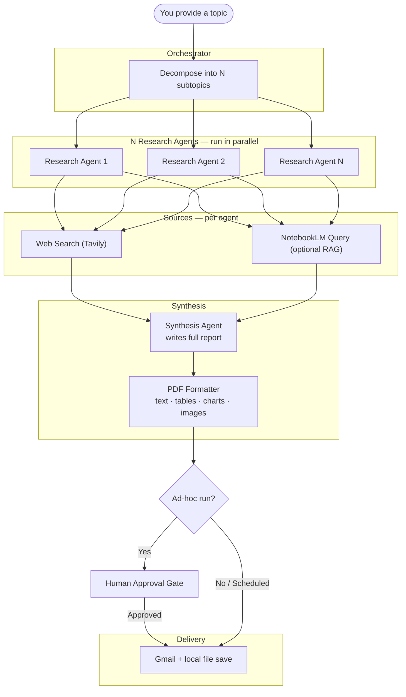

Research To Report Agent
========================

Turn any research topic into a polished, emailed PDF report — fully automated, with a human-in-the-loop option.

[](LICENSE)
[](https://www.python.org/)
[](CONTRIBUTING.md)

---

## What Is This?

Keeping up with a fast-moving domain is genuinely hard. Whether you are tracking industry trends, monitoring a competitor landscape, or building a knowledge base for a team, the work is the same: search, read, synthesize, write, format, share. Done manually, a single quality research brief can take hours. Done poorly, it produces a wall of raw notes that nobody reads.

Research-to-Report is an autonomous agent that does that entire loop for you. You give it a topic. It breaks the topic into focused subtopics and spins up parallel research agents — each one independently searching the web, pulling from your own curated knowledge sources in NotebookLM, and synthesising what it finds. A final synthesis agent combines the results into a structured, professional PDF report that is delivered to your inbox.

What makes this approach different from a simple "ask ChatGPT to research X" workflow is the architecture. Each research agent works on a narrow slice of the problem, which means they go deeper and stay focused rather than producing shallow summaries. NotebookLM acts as a personal RAG layer on top of general web search — your curated sources get equal weight alongside live web results, so domain-specific knowledge you have already collected is not lost. And because the agents are running in parallel, a topic that might take a person half a day produces a finished report in minutes.

The agent layer is model-agnostic by design. It is built on [LiteLLM](https://github.com/BerriAI/litellm), which means you can point it at Claude, Gemini, GPT-4, or any other supported model by changing a single line in `config.yaml` — no code changes required. You can even assign different models to different roles: a faster, cheaper model for the parallel research agents and a more capable model for final synthesis. The default is Claude, but the architecture does not depend on it.

The human-in-the-loop design is intentional. On ad-hoc runs, you see a preview of the report and approve it before the email is sent — you stay in control of what lands in people's inboxes. Scheduled runs skip the gate and deliver automatically, which works well for recurring briefings where the cadence matters more than per-report review. Both modes write a full audit log, so you always know what was searched, what was found, and when.

---

## How It Works



---

## Prerequisites


| Requirement | Purpose | Required? |
|---|---|---|
| Python 3.11+ | Runtime | Yes |
| LLM provider API key | AI reasoning — research, synthesis, report writing (Claude by default; Gemini and GPT also supported) | Yes — key for your chosen provider |
| Tavily API key | Web search | Yes |
| Composio API key | Gmail delivery via OAuth | Yes |
| uv + Chrome | NotebookLM browser automation | Only if using NotebookLM |

---

## Setup

### 1. Install dependencies

```bash
cd research-to-report/
pip install -r requirements.txt
pip install -e .
```

`requirements.txt` contains all the Python libraries this project depends on — the LLM client, PDF renderer, web search client, and more. Without them, the agent cannot run. The second command (`pip install -e .`) registers the `research-report` CLI binary on your system using the entry point defined in `pyproject.toml`, so you can run the agent from anywhere in your terminal.

**If `research-report` is not found after installing**, pip placed the binary in a Scripts/bin directory that is not yet on your system PATH. This is a common one-time setup step. Find and add the right folder for your OS:

<details>
<summary>Windows</summary>

Find your Scripts folder:

```powershell
python -m site --user-base
# Returns something like: C:\Users\YourName\AppData\Roaming\Python
# Add \Python3XX\Scripts to the end (match your Python version, e.g. Python314)
```

Add it to your user PATH permanently (run in PowerShell, then restart your terminal):

```powershell
[Environment]::SetEnvironmentVariable(
    "PATH",
    $env:PATH + ";C:\Users\YourName\AppData\Roaming\Python\Python314\Scripts",
    "User"
)
```

Alternatively, add it via **System Properties → Advanced → Environment Variables → User variables → Path → Edit → New**.

</details>

<details>
<summary>macOS</summary>

Find your bin folder:

```bash
python3 -m site --user-base
# Returns something like: /Users/yourname/Library/Python/3.11
# Append /bin to get the full path
```

Add it permanently (append to `~/.zshrc` or `~/.bash_profile`, then restart your terminal):

```bash
export PATH="$HOME/Library/Python/3.11/bin:$PATH"
```

</details>

<details>
<summary>Linux</summary>

pip places user-installed binaries in `~/.local/bin` by default.

Add it permanently (append to `~/.bashrc` or `~/.zshrc`, then restart your terminal):

```bash
export PATH="$HOME/.local/bin:$PATH"
```

</details>

If you prefer not to install the binary at all, you can always run the agent directly:

```bash
python src/main.py research "your topic here"
```

---

### 2. Get your API keys

Each service the agent talks to requires its own API key. These keys authenticate the agent's requests — they are never shared and should never be committed to version control.

**LLM provider**

The agent uses an LLM for topic decomposition, research synthesis, and final report writing. It is model-agnostic — the default is Claude (Anthropic), but you can switch to Gemini, GPT, or any other [LiteLLM-supported model](https://docs.litellm.ai/docs/providers) by changing `agent.default_model` in `config.yaml`.

Get the key for whichever provider you plan to use:

| Provider | Where to get the key | `.env` variable |
|---|---|---|
| **Anthropic (Claude)** — default | [console.anthropic.com](https://console.anthropic.com) → API Keys → Create Key | `ANTHROPIC_API_KEY` |
| **Google (Gemini)** | [aistudio.google.com](https://aistudio.google.com) → Get API Key | `GOOGLE_API_KEY` |
| **OpenAI (GPT)** | [platform.openai.com](https://platform.openai.com) → API Keys → Create | `OPENAI_API_KEY` |

Only the key for your chosen provider is required. The others can be left unset.

**Tavily (web search)**

Tavily is the web search engine the research agents use. Each subtopic search costs a small number of credits. The free tier provides 1,000 credits/month, which covers approximately 35–70 reports depending on depth.

1. Go to [tavily.com](https://tavily.com) and sign up
2. Copy your API key from the dashboard

**Composio (Gmail delivery)**

Composio handles Gmail OAuth so you never need to configure Google credentials directly. It acts as a secure bridge between the agent and your Gmail account.

1. Go to [app.composio.dev](https://app.composio.dev) and sign up
2. Navigate to **Settings** → **API Keys** → **Create API Key**
3. Copy the key

---

### 3. Connect Gmail via Composio

The agent sends reports from your Gmail account. Composio handles the OAuth flow — you grant access once and it manages the tokens from then on.

1. Log in at [app.composio.dev](https://app.composio.dev)
2. Go to **Apps** → search for **Gmail** → click **Connect**
3. Complete the Google OAuth flow and authorise the Gmail scopes

> **Connection expiry:** When you start a research run, the agent automatically checks that your Gmail connection in Composio is still active before any research begins. If the connection has been revoked or disconnected you will see:
> ```
> [ERR-AUTH-008] No active Gmail connection found in Composio.
>   Connect your Gmail account at app.composio.dev → Apps → Gmail → Connect.
> ```

After connecting, every report email will be sent from the Google account you authorised.

---

### 4. Configure environment variables

```bash
cp .env.example .env
```

Open `.env` and fill in the keys you collected in step 2:

```env
# LLM provider — set the key for whichever model you configure in config.yaml
ANTHROPIC_API_KEY=sk-ant-...   # required if using Claude (default)
# GOOGLE_API_KEY=...           # required if using Gemini
# OPENAI_API_KEY=...           # required if using GPT

TAVILY_API_KEY=tvly-...
COMPOSIO_API_KEY=...
```

This file is loaded at startup. It is listed in `.gitignore` — never commit it.

---

### 5. Configure recipients

```bash
cp config.yaml.example config.yaml
```

Open `config.yaml` and set your own sender's email and who receives every report:

```yaml
user_email: you@gmai.com
...

email:
  default_recipients:
    - recipient1@gmail.com
    - colleague@company.com
  default_cc: []
```

You can override recipients at run time with `--email` and `--email-cc` flags (see Usage below).

Optionally, you can enable NotebookLM by specifying your Notebook IDs — see **step 6** below for how to set that up.

---

### 6. Set up NotebookLM CLI (optional)

Skip this step if you do not plan to use NotebookLM as a knowledge source.

The agent queries NotebookLM via [`notebooklm-mcp-cli`](https://github.com/nmsn/notebooklm-mcp-cli), which drives a Chrome browser session. No Google service account or API key is required — authentication is handled entirely through the browser.

**Prerequisites:** Chrome must be installed on the machine where the agent runs.

**Install `uv` (if not already installed)**

`notebooklm-mcp-cli` is distributed via `uvx`, which is part of [`uv`](https://docs.astral.sh/uv/). If you do not have `uv`:

```bash
# macOS / Linux
curl -LsSf https://astral.sh/uv/install.sh | sh

# Windows (PowerShell)
powershell -ExecutionPolicy ByPass -c "irm https://astral.sh/uv/install.ps1 | iex"
```

Restart your terminal after installing so `uvx` is on your PATH.

**Install and authenticate notebooklm-mcp-cli**

```bash
uvx install notebooklm-mcp-cli
nlm login
```

The `nlm login` command opens Chrome and prompts you to sign in with your Google account. Complete the sign-in — your session is saved locally and reused on every subsequent run. You only need to do this once (or whenever the session expires — re-run `nlm login` to refresh).

> **Session expiry:** When you start a research run, the agent automatically checks that your NotebookLM session is still valid before any research begins. If the session has expired you will see:
> ```
> [ERR-AUTH-009] NotebookLM authentication has expired.
>   Run 'nlm login' in your terminal to re-authenticate, then retry.
> ```

**Find your Notebook ID**

Open [notebooklm.google.com](https://notebooklm.google.com) and navigate to the notebook you want to use. Copy the UUID from the URL:

```
https://notebooklm.google.com/notebooklm?notebook=<YOUR-NOTEBOOK-UUID>
```

**Add the Notebook ID to config.yaml**

```yaml
notebooklm:
  notebook_ids:
    - YOUR-NOTEBOOK-UUID
```

You can add multiple IDs. Leave the list empty (`[]`) to use web search only.

---

## Usage

```bash
# Ad-hoc run — research, generate PDF, prompt for approval, then send
research-report research "AI trends in healthcare"

# Override recipients for this run only
research-report research "AI trends" --email boss@company.com --email-cc reviewer@company.com

# Dry run — validates config and shows what would happen, no API calls made
research-report research "AI trends" --dry-run

# Start the scheduler (automated cron runs, no approval gate)
research-report scheduler start

# Resume an incomplete run
research-report resume
```

---

## Configuration

Edit `config.yaml` to control agent behaviour. Key settings:


| Setting                    | Default             | Notes                                                     |
| -------------------------- | ------------------- | --------------------------------------------------------- |
| `agent.default_model`      | `claude-sonnet-4-6` | Any LiteLLM-supported model (Claude, Gemini, GPT-4, etc.) |
| `agent.max_subtopics`      | `5`                 | Number of parallel research agents to spawn               |
| `agent.title_word_limit`   | `40`                | Target max words for the generated report title           |
| `languages`                | `[en]`              | Report language versions to generate                      |
| `notebooklm.notebook_ids`  | `[]`                | Leave empty for web-only research                         |
| `schedule.enabled`         | `false`             | Set`true` to enable cron runs                             |
| `email.default_recipients` | `[]`                | Who receives every report                                 |

### Using NotebookLM as a personal knowledge source

If you maintain notebooks in [NotebookLM](https://notebooklm.google.com), you can point the agent at them to include your curated sources alongside web search results. This turns NotebookLM into a personal RAG layer — your existing research gets incorporated into every new report rather than being siloed.

Add your notebook IDs to `config.yaml`:

```yaml
notebooklm:
  notebook_ids:
    - your-notebook-id-here
```

Leave this list empty to use web search only. See **Setup → step 6** for full installation and authentication instructions.

### Multi-language reports

English is always generated. Add Chinese variants to produce additional translated PDFs automatically:

```yaml
languages:
  - en       # English (always generated)
  - zh-CN    # Simplified Chinese
  - zh-TW    # Traditional Chinese
```

Each language produces a separate PDF file. Only the English version is emailed; translated PDFs are saved locally.

To translate an existing PDF manually:

```bash
python src/pdf/translator.py reports/my-report.pdf --lang zh-CN
```

---

## Testing

```bash
# Run all 127 unit tests (zero API calls made — all external services are mocked)
pytest tests/ -v

# Dry-run smoke test (validates your config without making any API calls)
research-report research "AI trends" --dry-run
```

---

## Project Structure

```
research-to-report/
├── src/
│   ├── main.py                   # CLI entry point
│   ├── agents/                   # AI pipeline
│   │   ├── orchestrator.py       # topic decomposition + parallel dispatch
│   │   ├── researcher.py         # per-subtopic research agent
│   │   └── synthesizer.py        # final report synthesis
│   ├── tools/                    # External integrations
│   │   ├── web_search.py         # Tavily web search
│   │   └── notebooklm_reader.py  # NotebookLM MCP client
│   ├── pdf/                      # PDF generation
│   │   ├── formatter.py          # ReportLab renderer (text, tables, charts, images)
│   │   └── translator.py         # PDF translation to zh-CN / zh-TW
│   ├── delivery/                 # Report delivery
│   │   ├── email_sender.py       # Gmail via Composio
│   │   └── approval.py           # human-in-the-loop approval prompt
│   ├── config/                   # Configuration loading
│   ├── log/                      # Structured logging and run state
│   └── run/                      # Scheduler, resume, preflight checks
├── tests/                        # Unit tests (127 tests, zero external calls)
├── reports/                      # Generated PDFs and logs (git-ignored)
├── docs/plans/                   # Design and implementation docs
│   ├── research-to-report-design-v1.md        # Architecture, error codes, state schema
│   └── research-to-report-implementation-v1.md # Task-by-task build plan
├── config.yaml
├── pyproject.toml
└── requirements.txt
```

### Design and Implementation Docs

| Document | What it covers |
|---|---|
| [Design doc](docs/plans/research-to-report-design-v1.md) | System architecture, agent design, state machine, all error codes (ERR/WRN), configuration schema, logging format, testing strategy |
| [Implementation doc](docs/plans/research-to-report-implementation-v1.md) | Task-by-task build plan with failing tests → implementation → verification steps for every module |

---

## License

Apache License 2.0 — see [LICENSE](LICENSE).

---

## Contributing

Contributions are welcome. See [CONTRIBUTING.md](CONTRIBUTING.md) for guidelines and the project Code of Conduct.
